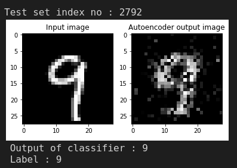
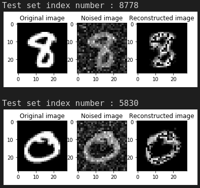
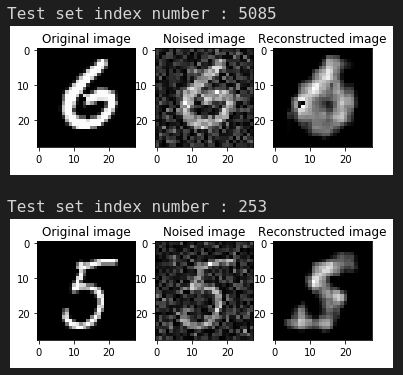

# Autoencoders

Autoencoders are a type of neural networks used to learn efficient data encodings, using **unlabelled data** (unsupervised learning). They have 2 parts, an **encoder network** and a **decoder network**. The encoder network converts input data into a more dense representation of the data. The decoder network takes this dense representation and tries to recreate the input data. They are used for **dimensionality reduction** or **feature extraction**

Since the input and output are the same, no labelling is required for training the autoencoder. The encoding learned can be used later as input to a classification network that can be trained using labelled data. Using autoencoders can reduce need for large labelled datasets.

## Use for classification

The representation learned by the encoder network can be used by a classifier network, since it is expected to have only relevant data about the input.

[Autoencoder classification jupyter notebook](./autoencoder_classification.ipynb)

## Denoising autoencoders

Autoencoders can also be used for removing noise in an image. This can be done by giving noisy inputs and training the network to give a clean output. Apart from removing noise, adding noise can also be usefull for making the autoencoder learn more robust features.

[Denoising autoencoder Jupyter notebook](./denoising_autoencoder.ipynb)

Convolutional layers can be used instead of linear layers to form convolutional denoising autoencoders.

[Convolution denoising autoencoder Jupyter notebook](./convolutional_denoising_autoencoder.ipynb)

# References