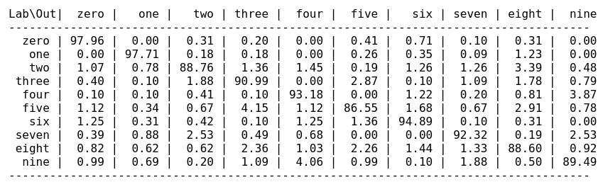

# Autoencoders

Autoencoders are a type of neural networks used to learn efficient data encodings, using **unlabelled data** (unsupervised learning). They have 2 parts, an **encoder network** and a **decoder network**. The encoder network converts input data into a more dense representation of the data. The decoder network takes this dense representation and tries to recreate the input data. They are used for **dimensionality reduction** or **feature extraction**

Since the input and output are the same, no labelling is required for training the autoencoder. The encoding learned can be used later as input to a classification network that can be trained using labelled data. Using autoencoders can reduce need for large labelled datasets.

## Use for classification

The representation learned by the encoder network can be used by a classifier network, since it is expected to have only relevant data about the input.

[Autoencoder classification jupyter notebook](./autoencoder_classification.ipynb)

## Denoising autoencoders

Autoencoders can also be used for removing noise in an image. This can be done by giving noisy inputs and training the network to give a clean output. Apart from removing noise, adding noise can also be usefull for making the autoencoder learn more robust features.

[Denoising autoencoder Jupyter notebook](./denoising_autoencoder.ipynb)

Convolutional layers can be used instead of fully connected layers to form convolutional denoising autoencoders.

[Convolution denoising autoencoder Jupyter notebook](./convolutional_denoising_autoencoder.ipynb)

## Sparse autoencoders

Sparsity (high number of zero activations) can be forced into an autoencoder by adding a penality term to the loss function. This is the L1 norm value (sum of magnitudes) of weights in the activation layer. This works by encouraging the neural network to learn more specialised encodings, i.e, having the encodings be more representative and useful, by removing unnecessary noisy activations. This is used in the autoencoder classification example. Comparison:

Confusion matrix without sparsity

Confusion matrix with sparcity

- Normalised row-wise

---

# References