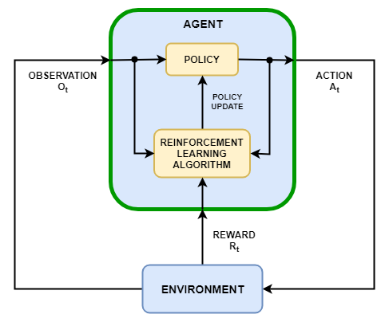

# Q-learning

Q-learning is a **reinforcement learning** algorithm. Reinforcement learning is a subset of machine learning wherein an AI agent can learn from its interactions with its environment. It along with supervised and unsupervised learning is one among the 3 major paradigms of machine learning.

In reinforcement learning, the entity that interacts with the environment is called the **agent**. The agent must choose an action to proceed towards some goal, which we is what we are training it to reach. The process used by the agent to choose the next action is called the **policy**.

The task of reinforcement learning is to choose an optimum policy to perform a given task. The agent makes **observations** from the environment. This is the input for the policy. The output is the action to be taken.

To train the agent, instead of giving it some labelled data like in supervised learning, we define **rewards**. The agent tries to maximize the total reward that it receives. Think of it like training a dog with treats.



Q-learning is a type of reinforcement learning. In a Q learning algorithm, the agent sees the environment as a **markov process**. In a markov process, the next state is determined only from the current state and action. In Q-learning, we rank all the possible actions using a value called the Q-value, which probably means quality. This of course, is where the  algorithm gets its name. During runtime, the action with the highest Q-value is chosen.

The simplest Q-learning algorithm uses a table to store the quality for all possible pairs of states and actions. During learning, this table is updated. To use the trained algorithm, we look up values in this table. 

Q-learning in runtime acts like a **greedy algorithm**. It does what it deems is optimal by considering only its local situation. However, to learn something, say to play chess or go, the agent needs to form long-term strategies. For this, the Q function is a sum of immediate reward at the state achieved through taking an action and the maximum of the Q value that can be achieved from another step from that state. This way, rewards can propagate backwards. The desired value for the Q value of a particular state-action pair is,

```Q[state, action] = reward + lambda * max(Q[next_state, :])```

Lambda is the factor for decaying the reward. If lambda is very high, long-term benefit is prioritised. However, learning such a strategy will take a long time because the Q value must propagate backwards. This desired value is then used for updating the currrent Q value by an updation rule, like gradient descent.

However, we first need to find where the rewards are to propagate them backwards. (for ```Q[next_state, :]``` to have any meaning) For this, we choose random actions, hoping to find rewards. This is called **exploration**. It is called off-policy learning, because learning happens by following a path without following the policy. Learning can also be done by choosing a path following the policy. This is called **exploitation**.

---

## Problem

---

## References

[Pytorch Q learning tutorial](https://pytorch.org/tutorials/intermediate/reinforcement_q_learning.html)

